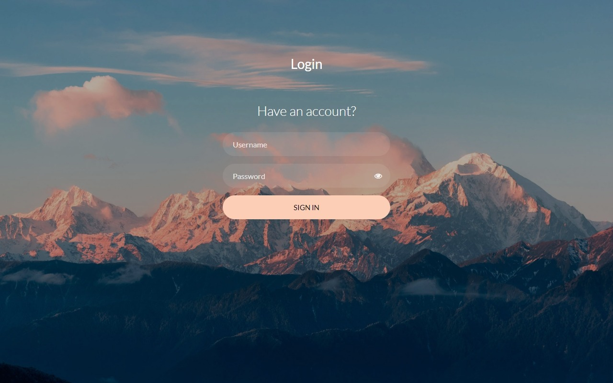
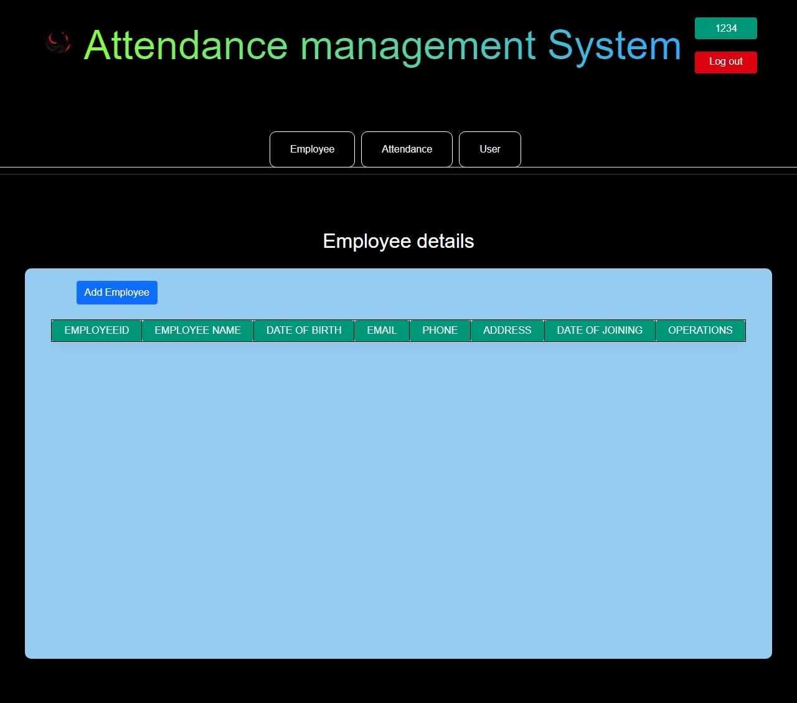
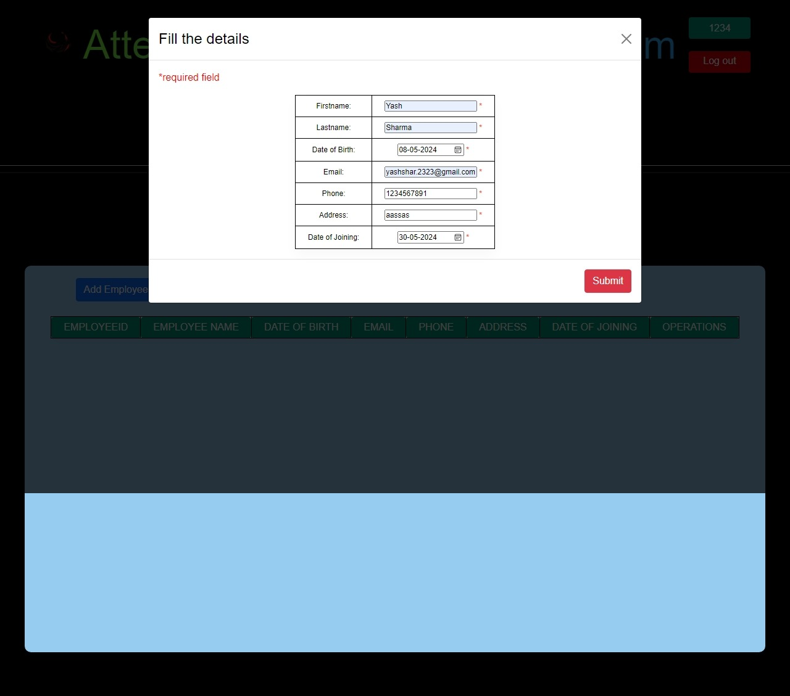
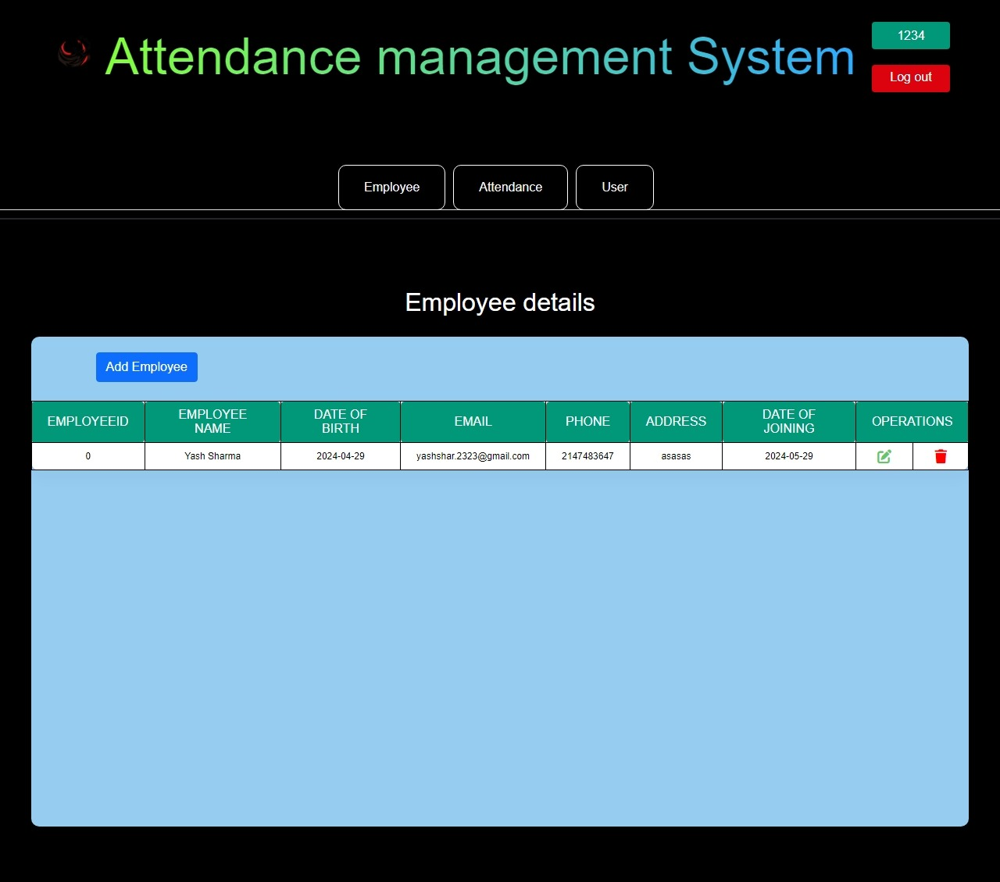

# Attendance Management Web Application

A full-stack attendance management system created for managing the attendance of employees working in a company. This project is a part of my web development php internship 2022. Used the complex use of php and MySql and setup a perfect attendance managment system. This project is a good practice for full-stack web development since from database setup to php codes everything is manually set.

## User Interface
  
  

## Features and Technologies used

- Add attendance of employees

- Update employee attendance and details.

- Full tables showcase of exmpoyees attendance.

- full Login/Logout and session functional

- Use Html/CSS for frontend

- Used PHP for backend development

- USed MySql for database functionality for both auth and employee data
 
## Prerequisites

Before you can use this application, ensure you have the following prerequisites:

- XAMPP installed
- MysQL datbase setup (manually for this project)
- Code editor (VS code)
- Git installed

## Setup

1. Clone this repository (if you haven't already):

   ```bash
   git clone https://github.com/yashsharma127/Attendance_management_PHP.git
   cd Attendance_management_PHP
   ```

2. Now rename env files from .env.example to .env

   ```bash
    Setup Your database for MySql using XAMPP
    create database named attendance with three tables user_login, employee and timesheet
    in user_login add columns username, password and name
    in employee add columns EmployeeID,Date_of_Birth,Email,Phone,Address,Date_of_Joining,Lastname,Firstname
    in timesheet add columns UserID,EmployeeID,Time_out,Time_in
   ```

## Note

Make sure to configure check datbase.php in Database folder for database connection.

This application is a starting point and can be expanded with additional features and improvements. Happy chatting!
 
